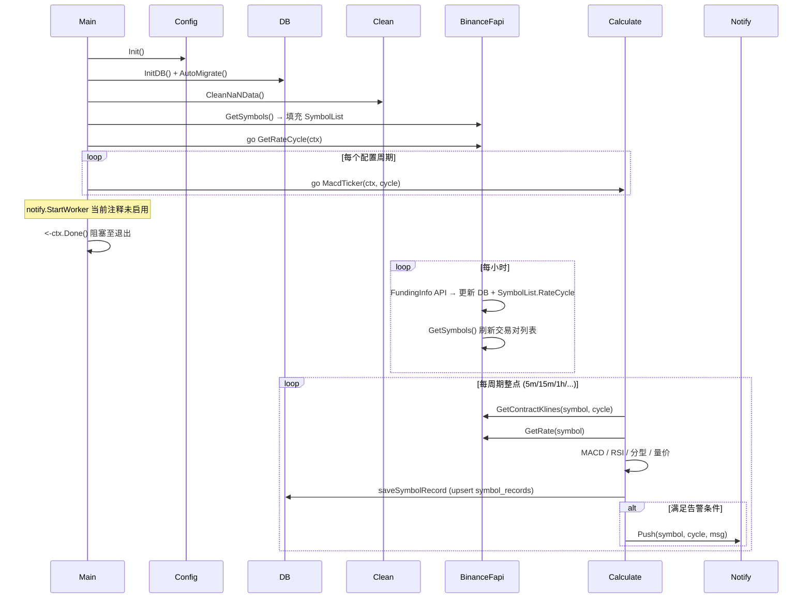
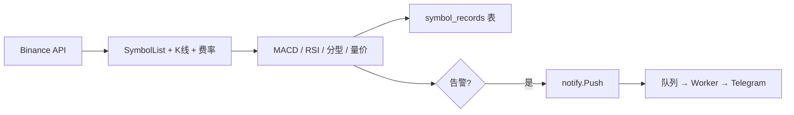

# IndicatorTask 项目架构说明

## 一、项目概述

IndicatorTask 是一个**加密货币合约指标计算任务**：从 Binance 合约 API 拉取 K 线与费率，按多周期（5m/15m/1h/4h/1d/1w/1M）计算 MACD、RSI、缠论分型、量价信号，结果写入数据库，并在满足条件时通过通知队列推送告警（当前 Worker 在 main 中注释未启用）。

---

## 二、整体架构图

```mermaid
flowchart TB
    subgraph Entry["main/main.go"]
        INIT[config.Init / logger.Init]
        DB[database.InitDB]
        MIGRATE[AutoMigrate]
        CLEAN[clean.CleanNaNData]
        GET_SYMBOLS_INIT[binanceFapi.GetSymbols]
        INIT --> DB --> MIGRATE --> CLEAN --> GET_SYMBOLS_INIT
    end

    subgraph Goroutines["常驻协程"]
        RATE_CYCLE[GetRateCycle 费率周期]
        TICKER_5M[MacdTicker 5m]
        TICKER_15M[MacdTicker 15m]
        TICKER_1H[MacdTicker 1h]
        TICKER_OTHER[MacdTicker 4h/1d/1w/1M]
        WORKER[notify.StartWorker 可选]
    end

    GET_SYMBOLS_INIT --> Goroutines

    subgraph BinanceAPI["Binance 合约 API"]
        API_PRICE[/fapi/v1/ticker/price]
        API_KLINES[/fapi/v1/klines]
        API_RATE[/fapi/v1/premiumIndex]
        API_FUNDING[/fapi/v1/fundingInfo]
    end

    subgraph binanceFapi["binanceFapi"]
        GetSymbols[GetSymbols]
        GetContractKlines[GetContractKlines]
        GetRate[GetRate]
        GetRateCycle[GetRateCycle]
        GetSymbols --> SymbolList[SymbolList 内存]
        GetRateCycle --> SymbolList
        GetRateCycle --> DB_UPDATE[(更新 rate_cycle)]
        GetRateCycle --> GetSymbols
        GetContractKlines --> Klines[K线数据]
        GetRate --> Rate[资金费率]
    end

    API_PRICE --> GetSymbols
    API_KLINES --> GetContractKlines
    API_RATE --> GetRate
    API_FUNDING --> GetRateCycle

    subgraph calculate["calculate"]
        MacdTicker[MacdTicker]
        Start[Start]
        MacdTicker --> Start
        Start --> GetContractKlines
        Start --> GetRate
        Start --> MACD[calculateMACD]
        Start --> RSI[GetRsi]
        Start --> Fractal[detectFractal]
        Start --> VolumePrice[detectVolumePrice]
        Start --> saveSymbolRecord[saveSymbolRecord]
        Start --> Push[notify.Push]
        MACD --> detectCrosses[detectCrosses]
        saveSymbolRecord --> DB_WRITE[(symbol_records)]
    end

    RATE_CYCLE --> GetRateCycle
    TICKER_5M --> MacdTicker
    TICKER_15M --> MacdTicker
    TICKER_1H --> MacdTicker
    TICKER_OTHER --> MacdTicker

    Start --> SymbolList
    Push --> Queue[通知队列]
    Queue --> WORKER
    WORKER --> Telegram[Telegram 推送]
```

---

## 三、启动与数据流



---

## 四、模块职责

| 模块 | 路径 | 职责 |
|------|------|------|
| **main** | `main/main.go` | 入口：初始化配置/DB/迁移、清理 NaN、拉取交易对、启动 GetRateCycle 与各周期 MacdTicker，阻塞直到退出信号 |
| **config** | `config/` | 加载 config.json：Cycles、Database、Api（Binance FAPI）、Benchmark（Klines 数、MACD/RSI 参数） |
| **binanceFapi** | `binanceFapi/` | 请求 Binance：GetSymbols（全市场最新价→SymbolList）、GetContractKlines（K 线）、GetRate（单 symbol 费率）、GetRateCycle（FundingInfo→DB + SymbolList.RateCycle，每小时 + 刷新 GetSymbols） |
| **calculate** | `calculate/` | 按周期定时执行 Start：遍历 SymbolList，取 K 线→算 MACD/RSI/缠论分型/量价→写库 saveSymbolRecord，满足条件时 notify.Push |
| **clean** | `clean/` | 启动时清理 symbol_records 中 NaN/Inf 及异常 RSI，避免 API 返回非法值 |
| **notify** | `utils/notify/` | 队列 + Push；StartWorker 从队列取任务，按订阅关系查库并调用 Telegram 发送（main 中当前未启用） |

---

## 五、核心数据流简图



---

## 六、配置依赖

- **config.json**  
  - `Cycles`：参与计算的周期列表（cycle、DelayMinutes、AlertCount）。  
  - `Database`：连接 public 包使用的 DB。  
  - `Api.Binance.FApi`：Price、Klines、Rate、FundingInfo 等 URL。  
  - `Benchmark`：Klines 数量、MACD 快/慢/信号线周期、RSI 周期与上下限。

- **数据库表**（public 包）  
  - `symbol_records`：按 symbol + cycle 存价格、成交量、RSI、费率、MACD 交叉、分型、量价信号等。  
  - `subscription` 等：供 notify 按订阅关系推送。

---

## 七、文件结构速览

```
IndicatorTask/
├── main/main.go           # 入口
├── config/                # 配置加载
├── binanceFapi/           # Binance 请求 + SymbolList
│   ├── getSymbols.go
│   ├── getKlines.go
│   └── getRate.go
├── calculate/             # 周期计算
│   ├── main.go            # Start + MacdTicker + saveSymbolRecord
│   ├── macd.go
│   ├── rsi.go
│   ├── detectFractal.go
│   ├── detectVolumePrice.go
│   ├── dataFmt.go
│   └── smc.go
├── clean/clean.go         # NaN 清理
└── utils/notify/          # 通知队列与 Telegram
```

以上为 IndicatorTask 的流程与架构说明，架构图使用 Mermaid，可在支持 Mermaid 的 Markdown 预览或文档站点中直接渲染。
